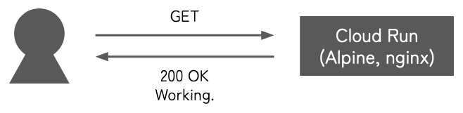
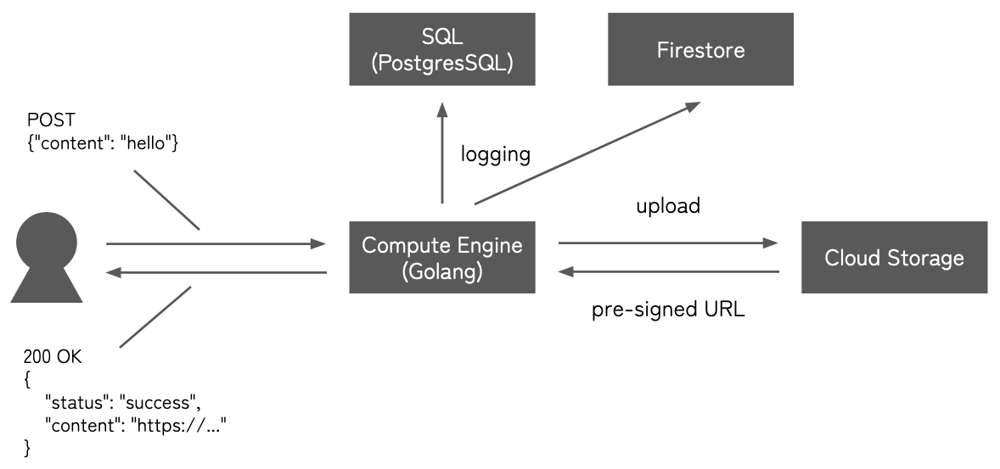

# 1. About

# 2. Prerequisites

# 3. `./cloud_functions/` project

## 3.1 About

This project creates a REST API which receives a JSON of the form `{"content": <string>}` and uploads its `content` as `<timestamp>.txt` to Cloud Storage. A signed URL (i.e. a public URL with expiration date) to access the object uploaded in Cloud Storage is returned.

## 3.2 Architecture


<!-- https://docs.google.com/presentation/d/1ITQbn7CoCnWI3O8fwQH6-TurLOHx4iAe2oX_AM6DeRE/edit#slide=id.g21f1d234fe4_0_23 -->

## 3.3 Usage

1. Access [*IAM & Admin console*](https://console.cloud.google.com/iam-admin/iam).

    1. Select `IAM` in the sidebar.

    2. Click the edit icon for the principal whose value of `Name` field is `Compute Engine default service account`.

    3. Select `ADD ANOTHER ROLE` to add `Service Account Token Creator` role.

2. Access [*Cloud Storage console*](https://console.cloud.google.com/storage/browser) to created a bucket named `test-bucket-001-a`.

3. Access [*Cloud Functions console*](https://console.cloud.google.com/functions/list) to create a function with the following settings.

    - Function name: `function-1`

    - Environment: `2nd gen`

    - Region: `us-central1`

    - Runtime: `Go 1.20`

4. Upload this project to deploy a function.
    ```bash
    $ gcloud functions deploy function-1 --source . --gen2 --region us-central1
    ```

5. Privately test the API. (At this time, the API is not public so we need `Authorization` header.)

    ```bash
    $ curl <URL> \
        -H "Authorization: bearer $(gcloud auth print-identity-token)" \
        -H "Content-Type: application/json" \
        -d '{"content": "hello"}'
    ```

    ```json
    {
        "status": "success",
        "url": "https://..."
    }
    ```

    ```bash
    $ curl <returned URL>
    ```

6. Access [*API Gateway console*](https://console.cloud.google.com/api-gateway/api) and select `CREATE GATEWAY` to create a gateway. For API Spec, upload `./cloud_functions/openapi.yaml`.

7. Now the API is public via API Gateway URL. Call the API.
    ```bash
    $ curl <URL> \
        -H "Content-Type: application/json" \
        -d '{"content": "hello"}'
    ```

    ```json
    {
        "status": "success",
        "url": "https://..."
    }
    ```

    ```bash
    $ curl <returned URL>
    ```

## 3.4 References

- [*GoogleCloudPlatform / functions-framework-go*](https://github.com/GoogleCloudPlatform/functions-framework-go)

- [*GoogleCloudPlatform / golang-samples*](https://github.com/GoogleCloudPlatform/golang-samples)

# 4. `./cloud_run/` project

## 4.1 About

This project deploys a very simple Docker container to Cloud Run.

## 4.2 Architecture



## 4.3 Usage

1. Interactively build and deploy `Dockerfile`. Allow unauthenticated invocations to issue a public URL.
    ```bash
    $ gcloud run deploy
    ```

    ```
    Allow unauthenticated invocations to [cloudrun] (y/N)?  y
    ```

2. Check the public URL of the deployment.
    ```bash
    $ gcloud run services list
    ```

3. Call the API.
    ```bash
    $ curl <URL>
    ```

    ```
    Working.
    ```

# 5. `./compute_engine/` project

## 5.1 About

This project creates a REST API which receives a JSON of the form `{"content": <string>}` and uploads its `content` as `<timestamp>.txt` to Cloud Storage. A signed URL (i.e. a public URL with expiration date) to access the object uploaded in Cloud Storage is returned. In addition, every request is logged to SQL (PostgresSQL) and Firestore.

## 5.2 Architecture



## 5.3 Usage

1. Access [*Firestore console*](https://console.cloud.google.com/firestore/databases/-default-/data/panel).

    1. If this is the very first time you visit the console, you may be requested to select `Native` mode or `Datastore` mode. Select `Native`.

    2. You don't have to manually create any collection as it will be automatically created when accessed.

2. Access [*SQL console*](https://console.cloud.google.com/sql/instances).

    1. Select `CREATE INSTANCE`.

    2. Choose `PostgresSQL`.

    3. Create an instance named `test-sql-001`.

    4. Select `Connections` in the sidebar.

    5. Select `ADD NETWORK` to add a network and specify your IP address.

3. Create a database in the SQL instance.

    1. Connect.
        ```bash
        $ PGPASSWORD=<password> psql -h <URL> -p 5432 -U postgres
        ```

    2. Create a database named `test`.
        ```
        CREATE DATABASE test;
        ```

    3. Check the result by listing all the databases.
        ```
        \list
        ```

4. Access [*Compute Engine console*](https://console.cloud.google.com/compute/instances).

    1. Select `CREATE INSTANCE` to create an instance named `instance-2`. Select `Allow full access to all Cloud APIs` for `Access scopes`. (To edit the value of `Access scopes` after creating the instance, first it shall be stopped.)

    2. Create a SSH key.
        ```bash
        $ gcloud compute ssh instance-2
        ```

    3. Connect to the instance via SSH.
        ```bash
        $ ssh gcp
        ```

    4. Install some packages.
        ```bash
        $ sudo apt update
        $ sudo apt install rsync screen
        ```

    5. Install Go by following [the official instructions](https://go.dev/doc/install).
        ```bash
        $ curl -L -O 'https://go.dev/dl/go1.20.2.linux-amd64.tar.gz'
        $ sudo tar -C /usr/local -xzf go1.20.2.linux-amd64.tar.gz
        $ echo 'export PATH=$PATH:/usr/local/go/bin' >> ~/.profile
        ```

5. Access [*VPC network console*](https://console.cloud.google.com/networking/networks/list).

    1. Select `Firewall` in the sidebar.

    2. Select `CREATE FIREWALL RULE` to create a rule which opens `8080` port.

6. Send this project to the instance.
    ```bash
    $ rsync -auv ./compute_engine gcp:./
    ```

7. Run the server.

    1. Connect to the instance.
        ```bash
        $ ssh gcp
        ```

    2. Build.
        ```bash
        $ cd compute_engine/
        $ go build main.go
        ```

    2. Run the server.
        ```bash
        $ screen -d -m ./main
        $ screen -ls
        ```

8. Call the API.
    ```bash
    $ curl <URL>:8080 -d '{"content": "hello"}'
    ```

    ```json
    {
        "status": "success",
        "url": "https://..."
    }
    ```

    ```bash
    $ curl <returned URL>
    ```

## 5.4 References

- [*GoogleCloudPlatform / golang-samples*](https://github.com/GoogleCloudPlatform/golang-samples)

<!-- vim: set spell: -->
