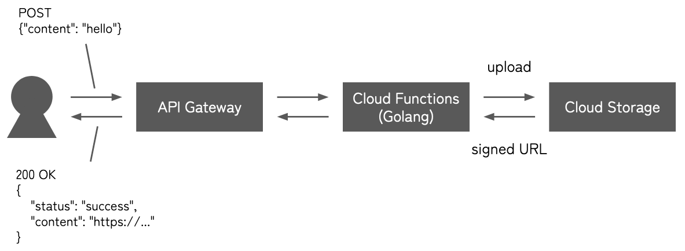

# 1. About

# 2. Prerequisites

# 3. `./cloud_functions/` project

## 3.1 About

This project creates a REST API which receives a JSON of the form `{"content": <string>}` and uploads its `content` as `<timestamp>.txt` to Cloud Storage. A signed URL (i.e. a public URL with expiration date) to access the object uploaded in Cloud Storage is returned.

## 3.2 Architecture



<!-- https://docs.google.com/presentation/d/1ITQbn7CoCnWI3O8fwQH6-TurLOHx4iAe2oX_AM6DeRE/edit#slide=id.g21f1d234fe4_0_23 -->

## 3.3 Usage

1. Access [*IAM & Admin console*](https://console.cloud.google.com/iam-admin/iam).

    1. Select `IAM` in the sidebar.

    2. Click the edit icon for the principal whose value of `Name` field is `Compute Engine default service account`.

    3. Select `ADD ANOTHER ROLE` to add `Service Account Token Creator` role.

2. Access [*Cloud Storage console*](https://console.cloud.google.com/storage/browser) to created a bucket named `test-bucket-001-a`.

3. Access [*Cloud Functions console*](https://console.cloud.google.com/functions/list) to create a function with the following settings.

    - Function name: `function-1`

    - Environment: `2nd gen`

    - Region: `us-central1`

    - Runtime: `Go 1.20`

4. Upload this project to deploy a function.
    ```bash
    $ gcloud functions deploy function-1 --source . --gen2 --region us-central1
    ```

5. Call the API.

    ```bash
    $ curl <URL> \
        -H "Authorization: bearer $(gcloud auth print-identity-token)" \
        -H "Content-Type: application/json" \
        -d '{"content": "hello"}'
    ```

    ```json
    {
        "status": "success",
        "url": "https://..."
    }
    ```

    ```bash
    $ curl <returned URL>
    ```

## 3.4 References

- [*GoogleCloudPlatform / functions-framework-go*](https://github.com/GoogleCloudPlatform/functions-framework-go)

- [*GoogleCloudPlatform / golang-samples*](https://github.com/GoogleCloudPlatform/golang-samples)


<!-- vim: set spell: -->

